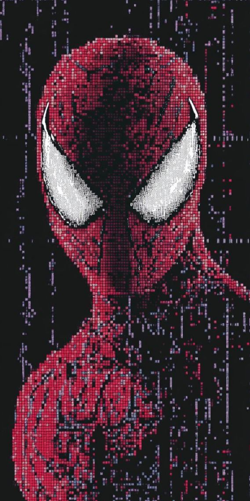

<table>
  <tr>
    <td width="65%" valign="top">
      <h1>🕸️ SPIDEE ⚡</h1>
      <h3><em>The Ultimate Retro Arcade Platformer Runner</em></h3>
      <p>
        <a href="https://spidee.vercel.app"></a>
      </p>
      <p>
        <a href="https://opensource.org/licenses/MIT"></a>
        
        
        
      </p>
      <p><em>Swing through city skylines, shoot web blasts, defeat rooftop thugs, face 5 legendary Spider-Man villains, activate Spider-Rage, and achieve ultimate victory in a 100vw borderless retro arcade experience!</em></p>
    </td>
    <td width="35%" align="center" valign="middle">
      
    </td>
  </tr>
</table>

---

## 🌐 Play Live Demo

👉 **[https://spidee.vercel.app](https://spidee.vercel.app)** 👈

---

## 🌟 Highlights & Key Features

### 🖥️ 1. **True Borderless Fullscreen & Integrated HUD**
- **100vw × 100vh Fullscreen**: Edge-to-edge canvas presentation without box borders or clutter.
- **Top-Right ⚙️ Settings Button**: Single touch-friendly menu button opening instant **Settings & Pause** overlay (Resume, Restart, Sound Effects & Music toggles).
- **Integrated Canvas HUD**: Clean display of `SPIDEE` logo, real-time `SCORE`, and `BEST RECORD`.

### 🦹 2. **5-Stage Main Villain Progression**
Face 5 legendary Spider-Man villains at score milestones:
- 🎃 **Green Goblin** (250 PTS) -> Pumpkin Bomb attacks (`+100 PTS` Defeat Bonus)
- 🐙 **Doctor Octopus** (600 PTS) -> Emerald Tentacle Energy (`+200 PTS` Defeat Bonus)
- ⌛ **Sandman** (1100 PTS) -> Golden Sand Blasts (`+300 PTS` Defeat Bonus)
- 🔮 **Mysterio** (1750 PTS) -> Cyan Illusion Smoke Blasts (`+400 PTS` Defeat Bonus)
- 🕷️🖤 **Venom Ultimate Boss** (2750 PTS) -> Pixel Art Symbiote Boss (`+500 PTS` Defeat Bonus)

### 🏆 3. **Game Victory & Winner Fanfare**
- Defeating **Venom Ultimate Boss** completes the game with a grand victory screen!
- **`🏆 VICTORY! YOU SAVED THE CITY! 🏆`** winner landing page with custom multi-note victory fanfare audio.

### 🪙 4. **Balanced Arcade Points System**
- **Coins (★)** = `+10 PTS`
- **Thugs (1-Hit Kill)** = `+20 PTS`
- **Main Villains** = `+100` to `+500 PTS`

### 🔥 5. **Spider-Rage Super Mode**
- Fill up the **Rage Meter** (+15% per kill, +8% per coin).
- Press **`SHIFT`** to activate 8 seconds of **Spider-Rage**:
  - Crimson glowing aura & screen shake.
  - **Triple Spread-Shot Laser Webs** with infinite web ammo!

### 🔊 6. **Synthesizer Web Audio & Music Engine**
- Synthesized web shoot sounds, knife throws, boss blasts, jump sfx, coin chimes, and victory fanfare.
- Continuous retro background music loop with instant mute/unmute toggles.

### ⚡ 7. **Secret Developer God Mode**
- Built-in hotkey for developer testing with infinite health, infinite webs, and void fall protection.

---

## 🎮 Controls Legend

| Desktop Key | Action |
| :--- | :--- |
| **`Spacebar`** | 🕸️ Shoot Web / Attack |
| **`←` / `→`** | Move Left / Right |
| **`↑`** | Single Jump |
| **`↑` + `↑`** | **Double Jump** |
| **`W` (Hold)** | ⏱️ **Web Swing Pendulum** |
| **`Shift`** | ⚡ **Activate Spider-Rage Mode** |
| **`Esc` / ⚙️ Button** | ⚙️ **Open Settings & Pause Menu** |
| **`Enter`** | 🔄 **Quick Restart Game** |

---

## 🚀 Quick Start (Play Locally)

No build tools required! Simply clone and open `index.html`:

```bash
# 1. Clone repository
git clone https://github.com/Jay2849/Spidee.git

# 2. Open directory
cd Spidee

# 3. Launch local server (or open index.html directly)
python -m http.server 8080
```
Open **[http://localhost:8080](http://localhost:8080)** in your browser!

---

## 📜 License

Distributed under the **MIT License**. See `LICENSE` for more information.

<div align="center">

Made with ❤️ & 🕸️ by **Jay2849** • **[https://spidee.vercel.app](https://spidee.vercel.app)**

</div>
